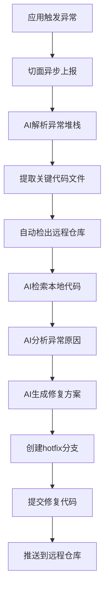

# AI Code Analyze

[](https://openjdk.java.net/)
[](https://maven.apache.org/)
[](https://spring.io/projects/spring-boot)
[](LICENSE)

> 基于Spring AI开发的智能代码异常分析服务，能够自动定位、分析并修复代码异常

## 📋 项目简介

AI Code Analyze 是一个智能化的代码异常分析系统，它能够：

- 🔍 **自动分析异常堆栈**：解析异常信息，精确定位问题代码
- 📥 **智能代码检出**：自动从远程仓库检出相关代码到本地
- 🤖 **AI驱动修复**：利用AI技术自动生成修复方案
- 🔄 **自动化提交流程**：自动创建hotfix分支并提交修复代码

## ✨ 核心功能

| 功能模块 | 描述 |
|---------|------|
| 🧠 AI代码静态分析 | 基于AI的代码质量分析和异常检测 |
| 📚 智能代码检出 | 自动从Git仓库检出相关代码文件 |
| 🔎 本地代码检索 | 高效检索和分析本地代码库 |
| 🚀 自动修复提交 | 自动创建修复分支并提交到远程仓库 |

## 🏗️ 系统架构

```
┌─────────────────┐    ┌─────────────────┐    ┌─────────────────┐
│   Spring Boot   │    │   MCP Client    │    │  Git MCP Server │
│   (模拟应用)     │───▶│   (AI分析服务)   │───▶│   (代码检出服务)  │
└─────────────────┘    └─────────────────┘    └─────────────────┘
```

## 📁 项目结构

```
ai-code-analyze/
├── git-mcp-server/          # Git仓库检出MCP服务
│   ├── src/main/java/
│   │   └── com/simon/gitmcpserver/
│   │       ├── GitMcpServerApplication.java
│   │       └── service/
│   │           └── GitService.java
│   └── pom.xml
├── mcp-client/              # AI分析服务主模块
│   ├── src/main/java/
│   │   └── com/simon/mcpclient/
│   │       ├── config/
│   │       │   └── AiAnalyzeConfig.java
│   │       ├── controller/
│   │       │   └── ChatBotController.java
│   │       ├── McpClientApplication.java
│   │       └── req/
│   │           └── ChatReq.java
│   ├── src/main/resources/
│   │   ├── application.yml
│   │   └── mcp-servers-config.json
│   └── pom.xml
├── spring-boot/             # 模拟应用模块
│   ├── src/main/java/
│   │   └── com/simon/springboot/
│   │       ├── Application.java
│   │       ├── controller/
│   │       │   └── UserController.java
│   │       ├── exception/
│   │       │   ├── AiAnalyzeHandler.java
│   │       │   └── GlobalExceptionHandle.java
│   │       └── req/
│   │           └── GetReq.java
│   ├── src/main/resources/
│   │   └── application.yml
│   └── pom.xml
├── pom.xml                  # 父级项目管理文件
└── README.md
```

## 🚀 快速开始

### 前置条件

- **Java**: JDK 17 或更高版本
- **Maven**: 3.8 或更高版本
- **Docker**: 用于容器化部署必须要的MCP服务

### 1. 克隆项目

```bash
git clone hhttps://github.com/csm1991/ai-code-analyze.git
cd ai-code-analyze
```

### 2. 配置环境

#### 修改 MCP Client 配置

编辑 `mcp-client/src/main/resources/application.yml`：


#### 修改 MCP 服务器配置

编辑 `mcp-client/src/main/resources/mcp-servers-config.json`：


### 3. 启动服务

按照以下顺序启动各个服务：

```bash
# 1. 启动 Git MCP Server
cd git-mcp-server
mvn spring-boot:run

# 2. 启动 MCP Client (AI分析服务)
cd ../mcp-client
mvn spring-boot:run

# 3. 启动 Spring Boot 模拟应用
cd ../spring-boot
mvn spring-boot:run
```

### 4. 测试功能

访问模拟应用的测试接口：

```bash
curl http://localhost:8892/api/get
```

这将触发一个异常，系统会自动：
1. 上报异常信息到 MCP Client
2. AI 解析异常堆栈
3. 自动检出相关代码
4. 生成修复方案
5. 创建 hotfix 分支并提交

## 📊 工作流程



## 🔧 配置说明

### 端口配置

| 服务 | 默认端口 | 说明 |
|------|----------|------|
| Git MCP Server | 8890 | Git仓库检出服务 |
| MCP Client | 8891 | AI分析服务 |
| Spring Boot | 8892 | 模拟应用 |

## 📝 更新日志

### v1.0.0 (2025-07-27)
- ✨ 初始版本发布
- 🚀 实现基础的AI代码分析功能
- 🔧 集成Git MCP Server
- 📚 添加完整的文档

## 📄 许可证

本项目采用 [MIT License](LICENSE) 许可证 - 查看 [LICENSE](LICENSE) 文件了解详情。

---

⭐ 如果这个项目对您有帮助，请给我们一个星标！